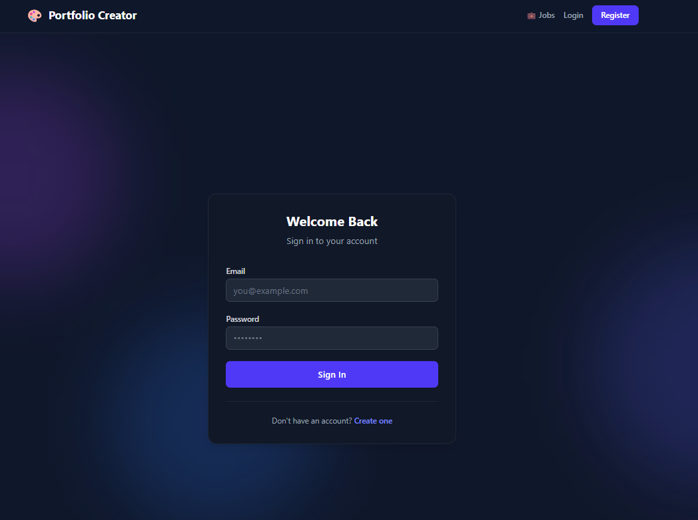

# 🚀 Portfolio Creator & Career Suite

<div align="center">


### **Empowering professionals to build, customize, analyze, and share stunning developer portfolios effortlessly.**

[](https://reactjs.org/)
[](https://vitejs.dev/)
[](https://tailwindcss.com/)
[](https://nodejs.org/)
[](https://www.mongodb.com/)
[](https://jwt.io/)

</div>

---

## 📖 Table of Contents

- [Overview](#-overview)
- [✨ Key Features](#-key-features)
- [📸 Screenshots & Visual Walkthrough](#-screenshots--visual-walkthrough)
- [🛠️ Tech Stack](#️-tech-stack)
- [📂 Project Structure](#-project-structure)
- [⚡ Quick Start & Installation](#-quick-start--installation)
  - [Prerequisites](#prerequisites)
  - [1. Backend Setup](#1-backend-setup)
  - [2. Frontend Setup](#2-frontend-setup)
  - [Environment Variables](#environment-variables)
- [🔌 API Endpoints](#-api-endpoints)
- [🤝 Contributing](#-contributing)
- [📄 License](#-license)

---

## 🌟 Overview

**Portfolio Creator** is an all-in-one full-stack web application engineered to supercharge career growth. It enables developers, designers, and students to build customizable, responsive portfolios in minutes, export them as professional PDF resumes, collect peer feedback/ratings, analyze portfolio strength, and search for real-time career opportunities via integrated job listings.

---

## ✨ Key Features

- **🔐 Secure Authentication**: JWT-based user authentication and protected session state.
- **🎨 Diverse Template Gallery**: Select from modern, beautifully designed portfolio templates crafted for different industries and styles.
- **🛠️ Interactive Live Builder**: Real-time portfolio customization including personal bios, work experience, projects, skills, education, certifications, and social links.
- **👁️ Live Responsive Preview**: Instant preview mode allowing creators to see how their portfolio renders on different viewport sizes.
- **🌐 Public Shareable Links**: Generate custom URLs to share live portfolios with recruiters, clients, and peers.
- **⭐ Peer Feedback & Rating System**: Visitors can leave star ratings and constructive feedback to help creators continuously improve.
- **📄 One-Click PDF Export**: High-fidelity PDF document generation using `html2pdf.js` for instant resume downloads.
- **📊 Portfolio Strength Analyzer**: Evaluates portfolio completion and suggests actionable recommendations to boost recruiter appeal.
- **💼 Integrated Job Search Portal**: Real-time job browsing powered by the JSearch API to match user skillsets with live job openings.

---

## 📸 Screenshots & Visual Walkthrough

<div align="center">

### 1. Landing & Discovery
*Modern, high-converting hero landing page introducing the suite.*
<br/>


<br/><br/>

### 2. Authentication & Onboarding
*Clean, secure authentication flow with responsive form validation.*
<br/>


<br/><br/>

### 3. Template Selection
*Curated collection of professional, responsive portfolio themes.*
<br/>


<br/><br/>

### 4. Interactive Portfolio Builder
*Intuitive editor to customize content, skills, projects, and personal branding.*
<br/>


<br/><br/>

### 5. Live Portfolio Preview & Public View
*Pixel-perfect portfolio preview with dynamic theming and responsive design.*
<br/>


<br/><br/>

### 6. Career & Job Search Portal
*Direct access to live developer jobs and role opportunities.*
<br/>


</div>

---

## 🛠️ Tech Stack

### **Frontend**
- **Framework**: [React 19](https://reactjs.org/) with [Vite](https://vitejs.dev/)
- **Styling**: [Tailwind CSS 4](https://tailwindcss.com/)
- **Animations**: [Framer Motion](https://www.framer.com/motion/)
- **Routing**: [React Router v7](https://reactrouter.com/)
- **Charts & Visuals**: [Recharts](https://recharts.org/)
- **PDF Export**: [html2pdf.js](https://ekoopmans.github.io/html2pdf.js/)
- **HTTP Client**: [Axios](https://axios-http.com/)

### **Backend**
- **Runtime**: [Node.js](https://nodejs.org/) (ES Modules)
- **Framework**: [Express.js 5](https://expressjs.com/)
- **Database**: [MongoDB](https://www.mongodb.com/) with [Mongoose 9](https://mongoosejs.com/)
- **Authentication**: [JSON Web Tokens (JWT)](https://jwt.io/) & [Bcrypt](https://www.npmjs.com/package/bcrypt)
- **External APIs**: [JSearch API](https://rapidapi.com/letscrape-6bRBa3QguO5/api/jsearch) / Nodemailer

---

## 📂 Project Structure

```text
portfolio-creator/
├── Screenshots/              # UI screenshots & media assets
│   ├── main page.png
│   ├── login.png
│   ├── portfolio template.png
│   ├── portfolio creation.png
│   ├── portfolio preview.png
│   └── job portal.png
├── backend/                  # Express REST API
│   ├── config/               # Database connection (db.js)
│   ├── controllers/          # Business logic handlers
│   ├── middleware/           # Auth & validation middleware
│   ├── models/               # Mongoose data schemas
│   ├── routes/               # API route definitions
│   ├── utils/                # Helper utilities
│   ├── .env.example          # Environment variables template
│   ├── package.json
│   └── server.js             # API entry point
└── frontend/                 # React + Vite client
    ├── public/               # Static public assets
    ├── src/
    │   ├── assets/           # UI media and icons
    │   ├── components/       # Reusable UI components
    │   ├── context/          # React context providers (AuthContext)
    │   ├── pages/            # View components (Builder, Dashboard, etc.)
    │   ├── services/         # API service integration
    │   ├── utils/            # Client-side helpers
    │   ├── App.jsx           # App layout & routing
    │   ├── index.css         # Global styles
    │   └── main.jsx          # React DOM entry
    ├── package.json
    └── vite.config.js
```

---

## ⚡ Quick Start & Installation

### Prerequisites
- [Node.js](https://nodejs.org/) (v18.x or higher)
- [MongoDB](https://www.mongodb.com/) (Local instance or MongoDB Atlas URI)
- [Git](https://git-scm.com/)

---

### 1. Backend Setup

```bash
# Navigate to backend directory
cd backend

# Install dependencies
npm install

# Create environment configuration file
cp .env.example .env
```

*Configure your `.env` variables as shown in the table below.*

```bash
# Start backend development server
npm run dev
```
*API will run at `http://localhost:5000`*

---

### 2. Frontend Setup

```bash
# Open a new terminal and navigate to frontend directory
cd frontend

# Install dependencies
npm install

# Start Vite development server
npm run dev
```
*Frontend application will run at `http://localhost:5173`*

---

### Environment Variables

#### **Backend (`backend/.env`)**
| Variable | Description | Example / Default |
| :--- | :--- | :--- |
| `PORT` | Backend server listening port | `5000` |
| `MONGO_URI` | MongoDB connection connection string | `mongodb://localhost:27017/portfolio_creator` |
| `JWT_SECRET` | Secret key used for signing JWT tokens | `your_secure_jwt_secret_key` |
| `RAPIDAPI_KEY` *(Optional)* | API key for JSearch job portal | `your_rapidapi_key` |

---

## 🔌 API Endpoints

| Method | Endpoint | Description | Protected |
| :--- | :--- | :--- | :---: |
| `POST` | `/api/auth/register` | Register a new user | No |
| `POST` | `/api/auth/login` | Authenticate user & get JWT token | No |
| `GET` | `/api/auth/profile` | Retrieve authenticated user profile | Yes |
| `GET` | `/api/portfolio` | Get user's saved portfolios | Yes |
| `POST` | `/api/portfolio` | Create or update a portfolio | Yes |
| `GET` | `/api/portfolio/:id` | Fetch public portfolio by ID/slug | No |
| `POST` | `/api/feedback/:id` | Submit star rating and review | No |
| `GET` | `/api/feedback/:id` | Retrieve all feedback for a portfolio | No |
| `GET` | `/api/jobs` | Query live developer job listings | Yes |

---

## 🤝 Contributing

Contributions, issues, and feature requests are welcome!

1. Fork the Project
2. Create your Feature Branch (`git checkout -b feature/AmazingFeature`)
3. Commit your Changes (`git commit -m 'Add some AmazingFeature'`)
4. Push to the Branch (`git push origin feature/AmazingFeature`)
5. Open a Pull Request

---

## 📄 License

This project is open source and available under the [ISC License](LICENSE).
