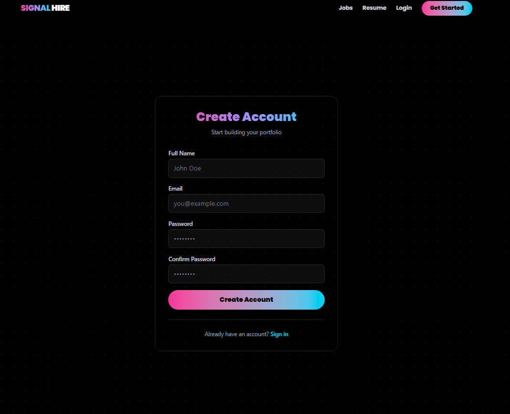
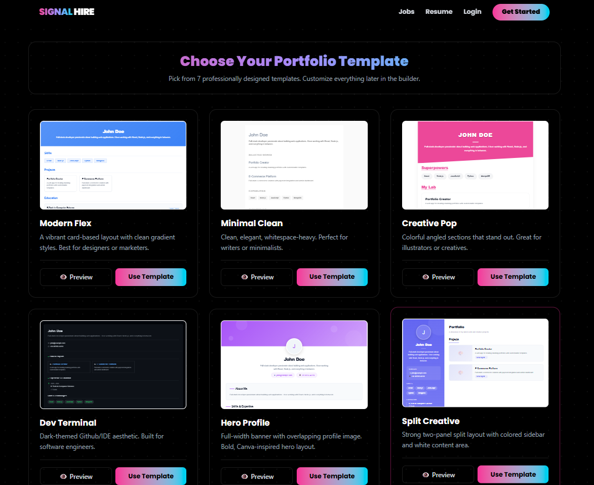

# 🚀 SignalHire - Portfolio and Career Platform

<div align="center">


### **Empowering professionals to build, customize, analyze, and share stunning developer portfolios & resumes effortlessly.**

[](https://reactjs.org/)
[](https://vitejs.dev/)
[](https://tailwindcss.com/)
[](https://nodejs.org/)
[](https://www.mongodb.com/)
[](https://ai.google.dev/)
[](https://jwt.io/)

</div>

---

## 📖 Table of Contents

- [🌟 Overview](#-overview)
- [✨ Key Features & Capabilities](#-key-features--capabilities)
- [📸 Screenshots & Visual Walkthrough](#-screenshots--visual-walkthrough)
- [🛠️ Tech Stack](#️-tech-stack)
- [📂 Project Structure](#-project-structure)
- [⚡ Quick Start & Installation](#-quick-start--installation)
  - [Prerequisites](#prerequisites)
  - [1. Backend Setup](#1-backend-setup)
  - [2. Frontend Setup](#2-frontend-setup)
  - [Environment Variables](#environment-variables)
- [🔌 API Endpoints](#-api-endpoints)
- [🤝 Contributing](#-contributing)
- [📄 License](#-license)

---

## 🌟 Overview

**SignalHire - Portfolio and Career Platform** is a full-stack career acceleration suite engineered to help developers, designers, and students build an impactful digital presence. 

SignalHire unifies **dynamic portfolio creation**, **AI-driven resume parsing and building**, **portfolio strength diagnostics**, **peer review & ratings**, and **real-time job searching** into a single cohesive, high-performance platform.

---

## ✨ Key Features & Capabilities

### 1. 🤖 AI-Powered Resume Builder & PDF Parser
- **Instant PDF Extraction**: Upload existing PDF resumes and automatically extract structured data using `pdf-parse` combined with **Google Gemini AI**.
- **Schema-Based Normalization**: Automatically maps unstructured resume content into structured fields: Personal Info, Work Experience, Education, Technical Skills, and Projects.
- **Tailored Resume Themes**: Choose from multiple professionally formatted resume templates including **Classic**, **Medical**, **Business**, **Academic**, and **Creative**.
- **Live Accent Customizer**: Dynamic color pickers to brand your resume.
- **High-Fidelity PDF Export**: Client-side document compilation using `html2pdf.js` for instant, print-ready downloads.

### 2. 🎨 Multi-Theme Portfolio Engine
- **Curated Template Collection**:
  - **Modern Flex**: Vibrant card-based layout with clean gradient styles.
  - **Minimal Clean**: Elegant, typography-focused, whitespace-heavy design.
  - **Creative Pop**: Expressive, angled layout for creative and design-driven professionals.
  - **Dev Terminal**: Dark IDE/terminal aesthetic tailored for software engineers.
  - **Hero Profile**: Bold, full-width banner layout with prominent profile focus.
  - **Split Creative**: Two-panel split layout with dedicated sidebar navigation.
  - **Timeline Portfolio**: Chronological vertical milestone showcase.
- **Full Customization**: Configure layout, font families, color palettes, section visibility, and profile avatars with real-time feedback.

### 3. 🛠️ Interactive Live Portfolio Builder
- **Real-Time Synchronous Editor**: Build and update bio, skills, education, experience, social profiles, and project links with live preview updates.
- **Live Viewport Preview**: Switch between mobile, tablet, and desktop views on the fly.
- **Image Upload Support**: Seamless profile photo and project thumbnail uploads.

### 4. 📊 Portfolio Strength Analyzer
- **Automated Quality Score**: Evaluates profile completeness across key recruiter criteria (descriptive bio, contact completeness, project depth, and skill breadth).
- **Actionable Diagnostic Feedback**: Highlights missing sections, weak descriptions, and provides targeted tips to boost recruiter appeal.

### 5. ⭐ Public Sharing & Peer Feedback System
- **Sharable Public URLs**: Unique permalinks to share live portfolios with recruiters, clients, and hiring managers.
- **Interactive Review System**: Visitors can leave star ratings and constructive feedback, empowering creators to continuously iterate on their presentation.

### 6. 💼 Real-Time Job Search Portal
- **Live Listings via JSearch API**: Search active developer and tech job openings worldwide.
- **Smart Filtering**: Filter opportunities by country/region (e.g., India, USA, UK, Global) and search keywords.
- **Direct Application Links**: Quick access to job details, company information, and application links.

### 7. 🔐 Secure Authentication & Session Management
- **JWT & Bcrypt Security**: Industry-standard password hashing and token-based route protection.
- **Profile Persistence**: User data, portfolios, and draft resumes securely stored in MongoDB with Mongoose.

---

## 📸 Screenshots & Visual Walkthrough

<div align="center">

### 1. Landing & Discovery
*Modern, high-converting hero landing page introducing the SignalHire platform.*
<br/>


<br/><br/>

### 2. Authentication & Onboarding
*Clean, secure authentication flow with responsive form validation.*
<br/>


<br/><br/>

### 3. Template Selection Gallery
*Curated collection of professional, responsive portfolio themes with live preview mode.*
<br/>


<br/><br/>

### 4. AI-Powered Resume Builder
*Smart PDF upload, Gemini AI parser, multi-theme layouts, and one-click PDF export.*
<br/>


<br/><br/>

### 5. Career & Job Search Portal
*Direct access to live developer jobs, keyword filtering, and regional search.*
<br/>


</div>

---

## 🛠️ Tech Stack

### **Frontend**
- **Framework**: [React 19](https://reactjs.org/) + [Vite 8](https://vitejs.dev/)
- **Styling**: [Tailwind CSS 4](https://tailwindcss.com/)
- **Animations**: [Framer Motion](https://www.framer.com/motion/)
- **Routing**: [React Router v7](https://reactrouter.com/)
- **Visuals & Charts**: [Recharts](https://recharts.org/)
- **PDF Generation**: [html2pdf.js](https://ekoopmans.github.io/html2pdf.js/)
- **HTTP Client**: [Axios](https://axios-http.com/)

### **Backend**
- **Runtime**: [Node.js](https://nodejs.org/) (ES Modules)
- **Framework**: [Express.js 5](https://expressjs.com/)
- **Database**: [MongoDB](https://www.mongodb.com/) with [Mongoose 9](https://mongoosejs.com/)
- **AI Integration**: [Google Gemini API](https://ai.google.dev/) (Structured JSON resume extraction)
- **PDF Parsing & Uploads**: [pdf-parse](https://www.npmjs.com/package/pdf-parse) & [Multer](https://www.npmjs.com/package/multer)
- **Validation**: [Zod](https://zod.dev/)
- **Authentication**: [JSON Web Tokens (JWT)](https://jwt.io/) & [Bcrypt](https://www.npmjs.com/package/bcrypt)
- **External APIs**: [JSearch RapidAPI](https://rapidapi.com/letscrape-6bRBa3QguO5/api/jsearch) & [Nodemailer](https://nodemailer.com/)

---

## 📂 Project Structure

```text
signal-hire/
├── Screenshots/              # UI screenshots & media assets
│   ├── main page.png         # Main landing hero page
│   ├── register.png          # Registration & authentication
│   ├── templates.png         # Portfolio template selection
│   ├── resume builder.png    # Resume builder & parser
│   └── job portal.png        # Job search portal
├── backend/                  # Express REST API
│   ├── config/               # Database connection (db.js)
│   ├── controllers/          # Business logic (auth, portfolio, feedback, job, resume)
│   ├── middleware/           # Auth validation & error handling
│   ├── models/               # Mongoose schemas (User, Portfolio, Feedback)
│   ├── routes/               # API route definitions
│   ├── utils/                # AI parser, schema validator, profile mapper
│   ├── .env.example          # Environment variables template
│   ├── package.json
│   └── server.js             # API entry point
└── frontend/                 # React + Vite client
    ├── public/               # Static public assets
    ├── src/
    │   ├── assets/           # UI media and icons
    │   ├── components/       # Reusable components & resume/portfolio templates
    │   ├── context/          # React Context (AuthContext)
    │   ├── pages/            # Views (Home, Builder, ResumeBuilder, Dashboard, Analyzer, etc.)
    │   ├── services/         # Axios API service layer
    │   ├── utils/            # Client-side utility functions
    │   ├── App.jsx           # App layout & route configuration
    │   ├── index.css         # Global Tailwind styles
    │   └── main.jsx          # React DOM entry
    ├── package.json
    └── vite.config.js
```

---

## ⚡ Quick Start & Installation

### Prerequisites
- [Node.js](https://nodejs.org/) (v18.x or higher)
- [MongoDB](https://www.mongodb.com/) (Local instance or MongoDB Atlas connection string)
- [Google Gemini API Key](https://aistudio.google.com/) *(for AI resume parsing)*
- [Git](https://git-scm.com/)

---

### 1. Backend Setup

```bash
# Navigate to backend directory
cd backend

# Install dependencies
npm install

# Create environment configuration file
cp .env.example .env
```

*Configure your `.env` variables according to the table below.*

```bash
# Start backend development server
npm run dev
```
*Backend API will run at `http://localhost:5000`*

---

### 2. Frontend Setup

```bash
# Open a new terminal and navigate to frontend directory
cd frontend

# Install dependencies
npm install

# Start Vite development server
npm run dev
```
*Frontend application will run at `http://localhost:5173`*

---

### Environment Variables

#### **Backend (`backend/.env`)**
| Variable | Description | Example / Default |
| :--- | :--- | :--- |
| `PORT` | Backend server listening port | `5000` |
| `MONGO_URI` | MongoDB connection string | `mongodb://localhost:27017/signal_hire` |
| `JWT_SECRET` | Secret key used for signing JWT tokens | `your_secure_jwt_secret_key` |
| `GEMINI_API_KEY` | Google Gemini API key for resume parsing | `your_gemini_api_key` |
| `GEMINI_MODEL` | Gemini model version for resume extraction | `gemini-3.8-flash` |
| `RAPIDAPI_KEY` *(Optional)* | API key for JSearch job search portal | `your_rapidapi_key` |

---

## 🔌 API Endpoints

| Method | Endpoint | Description | Protected |
| :--- | :--- | :--- | :---: |
| `POST` | `/api/auth/register` | Register a new user account | No |
| `POST` | `/api/auth/login` | Authenticate user & receive JWT token | No |
| `GET` | `/api/auth/profile` | Retrieve authenticated user profile | Yes |
| `GET` | `/api/portfolio` | Retrieve user's saved portfolios | Yes |
| `POST` | `/api/portfolio` | Create or update a portfolio | Yes |
| `GET` | `/api/portfolio/:id` | Fetch public portfolio by ID/slug | No |
| `POST` | `/api/feedback/:id` | Submit a star rating and written review | No |
| `GET` | `/api/feedback/:id` | Retrieve all feedback entries for a portfolio | No |
| `POST` | `/api/resume/upload` | Upload & parse PDF resume with Gemini AI | No |
| `GET` | `/api/jobs` | Query live tech job listings | Yes |

---

## 🤝 Contributing

Contributions, issues, and feature requests are welcome!

1. Fork the Project
2. Create your Feature Branch (`git checkout -b feature/AmazingFeature`)
3. Commit your Changes (`git commit -m 'Add some AmazingFeature'`)
4. Push to the Branch (`git push origin feature/AmazingFeature`)
5. Open a Pull Request

---

## 📄 License

This project is open source and available under the [ISC License](LICENSE).
